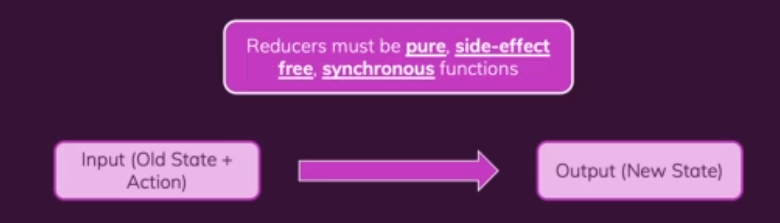

## 비동기 코드

우리의 리듀서 함수는 반드시 순수 함수여야 하며 부수 효과가 없고 동기식이어야 한다. 즉 리듀서 함수는 이전 상태 및 작업인 리덕스 리듀서의 경우에 인풋이 필요하며 아웃풋도 만들어 낸다. 그리고 이것은 리덕스 리듀서 함수에만 국한되는 것은 아니다. useReducer에 전달하는 리듀서 함수인 이 리액트 훅도 같은 방식으로 작동한다.

우리는 리덕스로 작업할 때 비동기 코드를 어디에 넣어야 할까?

리듀서 함수는 분명 잘못된 위치이기 때문이다. 우리는 side Effect를 두 개의 위치에 둘 수 있다. 예를 들어 useEffect를 사용하여 컴포넌트에 직접 비동기 코드의 부수 효과를 넣을 수 있다.
우리가 우리 자신의 작업 크리에이터 함수를 작성하는 새로운 것이 되어 자동으로 생성된 리덕스 툴킷이 제공하는 것을 사용하지 않을 수 있다. 대신 우리는 우리 자신의 작업 크리에이터를 작성하게 된다.
그리고 그 작업 크리에이터를 위해 리덕스는 실제로 우리가 이 작업 크리에이터의 일부로 부수 효과를 수행하고 비동기 작업을 실행할 수 있는 솔루션을 가지고 있다. 이것은 리듀서 함수를 바꾸지 않고도 가능한데 그 함수에는 부수 효과가 없어야 하기 때문이다.
