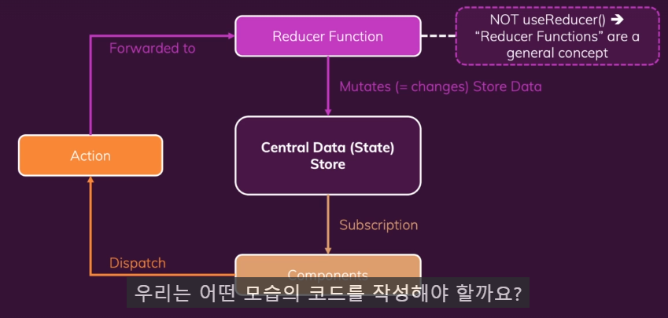

## Redux

리덕스는 크로스 컴포넌트 또는 앱 와이드 상태를 위한 상태 관리 시스템이다.

우리가 상태, 즉 우리 애플리케이션을 변경하고 화면에 표시하는 데이터를 관리하도록 도와준다.

리덕스는 우리가 그런 데이터를 다수의 컴포넌트나 심지어는 앱 전체에서 관리하도록 도와준다.

우리는 상태를 3가지로 나눌 수 있다.

1. Local State - 데이터가 변경되어서 하나의 컴포넌트에 속하는 UI에 영향을 미치는 상태.

2. Cross-Component State - 다수의 컴포넌트에 영향을 미치는 상태.

3. App-Wide State - 모든 컴포넌트에 영향을 미치는 상태.

</br>

### 굳이 React_context가 있는데 Redux를 쓰는 이유?

리액트 컨텍스트에는 잠재적인 단점이 몇 개 있다.

1. 리액트 컨텍스트를 사용하면 설정이 아주 복잡해질 수 있고 리액트 컨텍스트를 이용한 상태 관리가 상당히 복잡해질 수 있다는 점이다.


<br />

#### 사진처럼 ContextProvider 컴포넌트가 아주 많이 생기게 되는 경우

위의 경우를 피하기 위해 하나의 컨텍스트에 모든 설정을 하게 되면 그 컨텍스트 자체를 유지하고 관리하기가 어려워질 수 있다.

2. 성능.

리액트 팀원이 올린 공식 언급에서 컨텍스트는 테마를 변경하거나 인증 같은 저빈도 업데이트에는 아주 좋지만, 데이터가 자주 변경되는 경우에는 좋지 않다고 언급하였음. 또한 컨텍스트는 유동적인 상태 확산을 대체할 수 없다고도 언급하고 있다.

</br>

### 리덕스의 작동 방식

리덕스는 애플리케이션에 있는 하나의 중앙 데이터 저장소이다. 절대로 2개 이상은 갖지 않는다.

하나의 저장소에 전체 애플리케이션의 모든 상태를 저장한다. 그래서 그 저장소에 인증 상태, 테마 등 우리가 저장하려는 입력 상태 등 무엇이든 저장할 수 있다.

하나의 컴포넌트가 저장소를 구독하고 데이터가 변경될 때마다 저장소가 컴포넌트에게 알려준다. 그러면 컴포넌트는 필요한 데이터를 받게 된다. 리덕스 저장소의 일부를 받게 되는 것이다.

저장소에 저장된 데이터를 변경하는 방법으로는 컴포넌트는 절대로 데이터를 직접 조작하지 않는다. 데이터는 절대로 반대 방향으로 흐르지 않는다. 즉, 컴포넌트는 저장소에 있는 그 데이터를 직접 조작하지 않는다. 그 대신에 우리는 리듀서라는 개념을 이용한다.

우리는 리듀서 함수를 만들어 변형을 설정한다. 즉 저장소 데이터를 변경하는 것을 설정한다. 여기서의 리듀서 함수는 useReducer 훅과 다르다.

리듀서 함수는 입력을 받아서 그 입력을 변환하고 줄이는 함수이다. 입력을 변환해서 새로운 출력, 새로운 결과를 뱉어낸다.

컴포넌트와 리듀서 함수를 연결하는 방법으로는 컴포넌트가 액션(단순한 자바스크립트 객체)을 트리거하면 리덕스는 그 액션을 리듀서로 전달하고 액션에 담긴 작업에 대한 설명을 읽게 된다. 이어서 그 작업을 리듀서가 수행하게 된다. 그리고 나서 리듀서는 새로운 상태를 뱉어내고 그게 실제로 그 중앙 데이터 저장소의 기존 상태를 대체하게 된다. 데이터 저장소의 상태가 업데이트되면 구독 중인 컴포넌트가 알림을 받게 되고 컴포넌트는 UI를 업데이트할 수 있게 된다.



### Redux createStore()

createStore()라는 함수를 사용하여 리덕스 저장소를 생성할 수 있는데 코드에 이 함수를 사용하면, IDE에서 또는 앱을 실행할 때 사용 중단 경고가 나올 수도 있다.

하지만 그것은 아무 문제 없이 사용할 수 있지만 리액트 리덕스 팀은 리덕스 툴킷이라는 추가 패키지와 리덕스 스토어를 생성하는 다른 방법을 사용할 것을 권장한다.

</br>

### Redux 핵심 개념

#### 1. Reducer

Reducer는 애플리케이션의 상태(state)와 액션(action)을 받아서 새로운 상태를 반환하는 순수함수이다. Reducer는 이전 상태와 액션을 입력으로 받아 새로운 상태를 출력으로 반환한다. 중요한 점은 reducer 함수는 부작용이 없어야 하며, 입력 값을 변경하지 않고 항상 동일한 입력에 대해 동일한 출력을 반환해야 한다.

```jsx
const initialState = {
  count: 0,
};

function counterReducer(state = initialState, action) {
  switch (action.type) {
    case "INCREMENT":
      return {
        ...state,
        count: state.count + 1,
      };
    case "DECREMENT":
      return {
        ...state,
        count: state.count - 1,
      };
    default:
      return state;
  }
}
```

#### 2. Action

Action은 상태 변화를 일으키는 정보를 담고 있는 객체이다. Action 객체는 반드시 `type` 속성은 액션의 종류를 나타낸다. 그 외에 필요한 데이터는 임의로 추가할 수 있다. Action은 dispatch 함수를 통해 reducer로 전달되어 상태를 변화시킨다.

```jsx
const incrementAction = {
  type: "INCREMENT",
};

const decrementAction = {
  type: "DECREMENT",
};

// 혹은 함수로 정의하여 사용할 수 있습니다.
function increment() {
  return {
    type: "INCREMENT",
  };
}

function decrement() {
  return {
    type: "DECREMENT",
  };
}
```

```jsx
const incrementAction = {
  type: "INCREMENT",
};

const decrementAction = {
  type: "DECREMENT",
};

const addAction = {
  type: "ADD",
  payload: 5,
};
```

#### 3. Dispatch

Dispatch는 action을 reducer로 보내는 함수이다. Redux 스토어는 dispatch 메서드를 제공하여 상태를 업데이트 한다.

```jsx
store.dispatch(increment());
store.dispatch(decrement());
```
